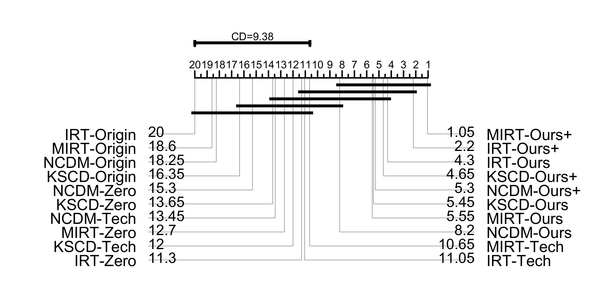
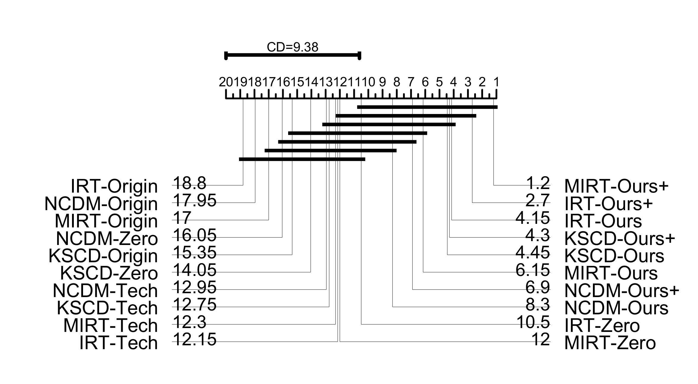
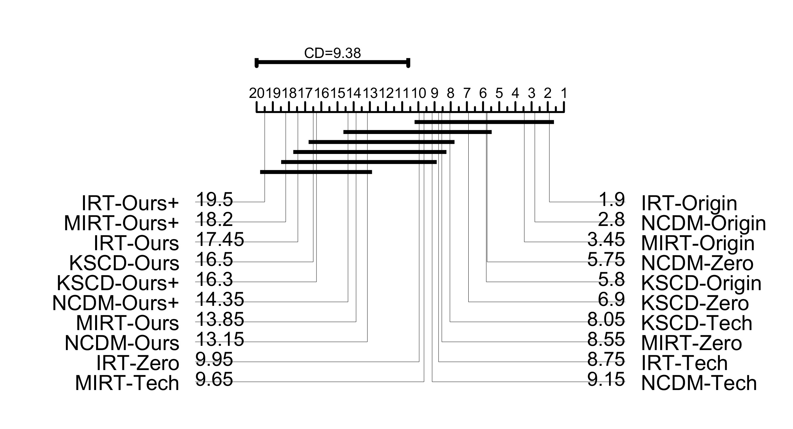
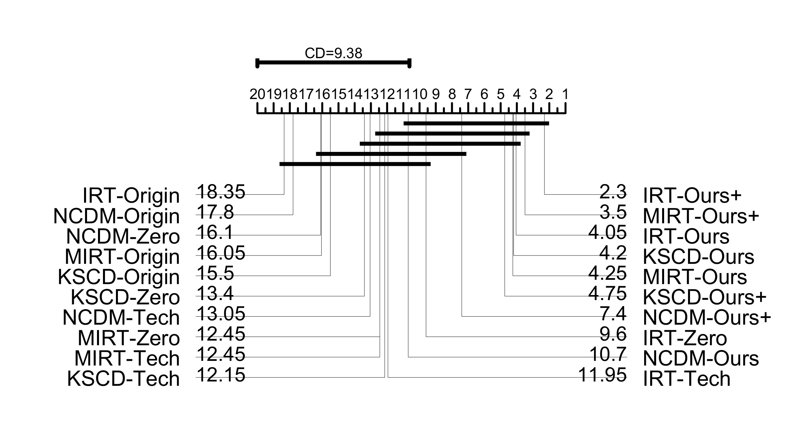
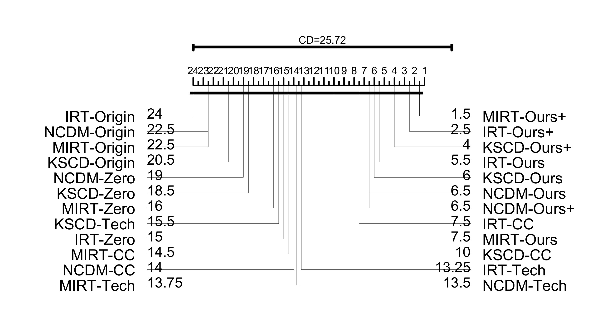
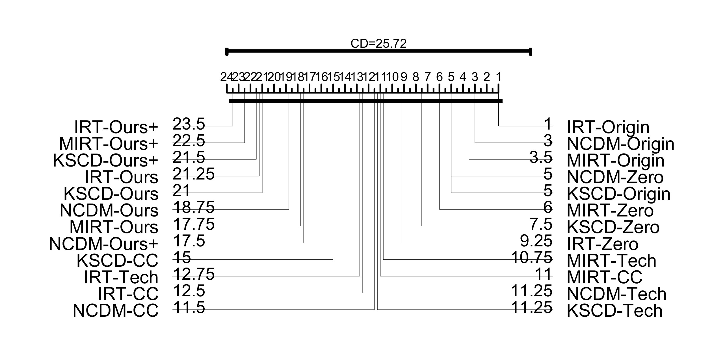
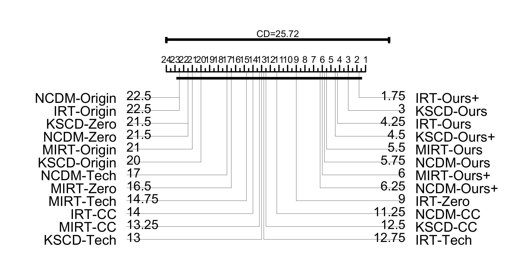
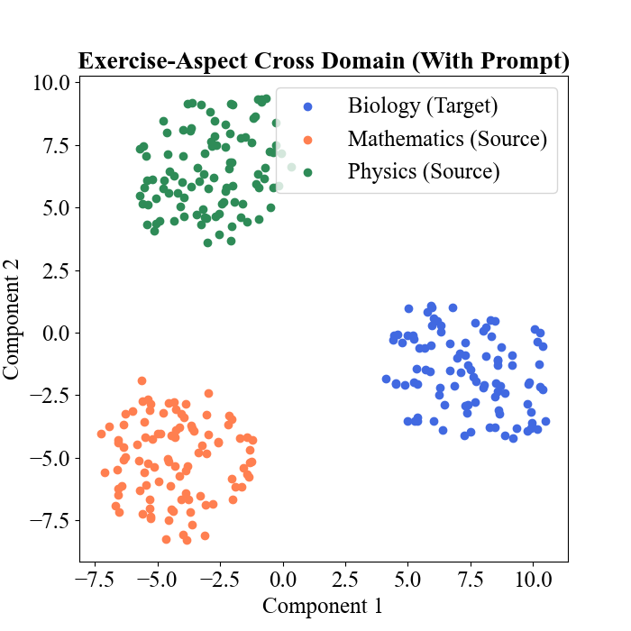

# PromptCD: Transferring Prompts for Cross Domain Cognitive Diagnosis 

## 目录

- [描述](#描述)
- [安装依赖](#安装依赖)
- [实验设置](#实验设置)
- [使用示例](#使用示例)
- [使用示例](#结果展示)
- [许可证](#许可证)
- [联系方式](#联系方式)

## 描述 

本项目是论文《Transferring Prompts for Cross Domain Cognitive Diagnosis》的开源代码，包含了我们在论文中使用的数据集、模型文件以及运行脚本。此外，还提供了运行文件的使用示例，帮助用户更好地理解和复现实验结果。

## 安装依赖

通过 `requirements.txt` 安装所有必要的依赖包：

```bash
pip install -r requirements.txt
```

## 实验设置

### 数据集划分
- 源域数据集按照 80% 训练集和 20% 测试集的比例划分，使用随机种子 42。
- 目标域数据集根据学生ID或习题ID，随机抽取 20% 的交互记录作为微调数据集，剩余 80% 的数据作为测试集，使用随机种子 2024。微调数据集进一步按照 9:1 的比例划分为训练集和验证集，使用随机种子 42。

### 模型训练
- 源域训练和目标域微调均采用学习率 lr=0.001，且使用早停机制。
- 源域训练中，当验证集的 AUC 连续 5 个 epoch 无显著提升（提升不超过 0.001）时，训练停止，耐心值为 5。
- 目标域微调同样采用耐心值 5，AUC 连续 5 个 epoch 无提升则停止训练。
- 源域训练和目标域微调的最大训练轮次均为 100 个 epoch。

## 使用示例

1. 可以使用默认参数直接运行 `main` 文件：
```bash
python main_ncdm_cross_subject.py
```

2. 也可以通过命令行传递参数运行：
```bash 
python main_ncdm_cross_subject.py \
  --rate 0.2 \
  --pp_dim 20 \
  --batch_size 256 \
  --model_file "model.pth" \
  --if_source_train 1 \
  --if_target_migration 2 \
  --folder "data1/理科_2+1/m_p+b" \
  --source "mat,phy" \
  --target "bio"
```

## 论文扩充

### 新增动机图

为了强化我们的研究动机，我们加入了关于深度学习认知诊断性能的讨论，强调这些模型在CDCD情境下也遇到的困难。下面以KSCD模型为例：


| Scenarios  | Source                      | Target          |
|------------|-----------------------------|-----------------|
| Scenario A | 20% Mathematics              | 40% Mathematics |
| Scenario B | 60% Mathematics              | 40% Mathematics |
| Scenario C | 20% Mathematics + Physics    | 40% Mathematics |
| Scenario D | 20% Mathematics + Chinese    | 40% Mathematics |

我们在 SLP 数据集上对 KSCD 模型进行了域内（A 和 B）和跨域（C 和 D）场景的实验，场景描述详见上表。结果总结如下：1）C 和 D 的表现不如 A 和 B，表明传统模型在 CDCD 场景中表现不佳；2）A 的表现不如 B，显示过拟合于有限数据是一个显著问题；3）D 的表现显著不如 C，这是由于中文与数学的分布差异大于物理与数学，突显了模型在 CDCD 场景中对源领域的敏感性。

### 新增显著性分析

我们对不同场景下使用的多种基线模型所产生的 AUC、ACC、RMSE 和 F1 等指标进行了 Nemenyi 测试以报告统计显著性，具体结果如下：






从分析结果可以看出，PromptCD 模型（特别是 "Ours+" 版本）在多个领域中显著优于其他对比模型。这进一步验证了跨域提示迁移方法在认知诊断任务中的有效性和鲁棒性。

### 新增对比模型

为了进行更全面的实验，我们添加了与 CCLMF 基线方法的对比，结果如下：

| Method | AUC | ACC | RMSE | F1 |
|---------------|-------|-------|-------|-------|
| IRT-Origin | 0.667 | 0.652 | 0.466 | 0.738 |
| IRT-Tech | 0.779 | 0.729 | 0.421 | 0.800 |
| IRT-Zero | 0.721 | 0.696 | 0.460 | 0.809 |
| IRT-CC | 0.775 | 0.723 | 0.425 | 0.808 |
| IRT-Ours | 0.798 | 0.742 | 0.411 | 0.815 |
| IRT-Ours++ | 0.799 | 0.743 | 0.411 | 0.816 |
| MIRT-Origin | 0.672 | 0.669 | 0.459 | 0.763 |
| MIRT-Tech | 0.779 | 0.727 | 0.422 | 0.797 |
| MIRT-Zero | 0.723 | 0.706 | 0.439 | 0.799 |
| MIRT-CC | 0.771 | 0.726 | 0.426 | 0.805 |
| MIRT-Ours | 0.793 | 0.738 | 0.415 | 0.816 |
| MIRT-Ours++ | 0.801 | 0.743 | 0.411 | 0.809 |
| NCDM-Origin | 0.706 | 0.655 | 0.456 | 0.724 |
| NCDM-Tech | 0.780 | 0.727 | 0.421 | 0.795 |
| NCDM-Zero | 0.734 | 0.697 | 0.437 | 0.792 |
| NCDM-CC | 0.765 | 0.731 | 0.424 | 0.811 |
| NCDM-Ours | 0.785 | 0.735 | 0.417 | 0.815 |
| NCDM-Ours++ | 0.788 | 0.731 | 0.418 | 0.812 |
| KSCD-Origin | 0.710 | 0.691 | 0.445 | 0.779 |
| KSCD-Tech | 0.778 | 0.729 | 0.422 | 0.799 |
| KSCD-Zero | 0.728 | 0.703 | 0.431 | 0.792 |
| KSCD-CC | 0.782 | 0.732 | 0.420 | 0.799 |
| KSCD-Ours | 0.795 | 0.741 | 0.413 | 0.818 |
| KSCD-Ours++ | 0.796 | 0.739 | 0.414 | 0.812 |

并进行了 Nemenyi 测试以报告统计显著性。结果如下：






与之前的分析一致，结果显示 PromptCD 模型仍然具有明显的性能优势。

### 新增跨域场景
我们添加了两项新实验：从人文学科到科学，以及从科学到人文学科。我们的结果表明，在这两种情况下，PromptCD 的表现都优于对比算法。

**Source:** Biology, Mathematics  **Target:** Geography
| Method | AUC | ACC | RMSE | F1 |
|---------------|-------|-------|-------|-------|
| IRT-Origin | 0.677 | 0.650 | 0.472 | 0.721 |
| IRT-Tech | 0.757 | 0.705 | 0.438 | 0.784 |
| IRT-Zero | 0.734 | 0.693 | 0.446 | 0.776 |
| IRT-CC | 0.775 | 0.715 | 0.427 | 0.791 |
| IRT-Ours | 0.791 | 0.726 | 0.422 | 0.795 |
| IRT-Ours++ | 0.792 | 0.727 | 0.421 | 0.792 |
| MIRT-Origin | 0.695 | 0.669 | 0.459 | 0.773 |
| MIRT-Tech | 0.765 | 0.709 | 0.435 | 0.787 |
| MIRT-Zero | 0.722 | 0.686 | 0.450 | 0.763 |
| MIRT-CC | 0.767 | 0.710 | 0.434 | 0.775 |
| MIRT-Ours | 0.786 | 0.720 | 0.428 | 0.794 |
| MIRT-Ours++ | 0.791 | 0.728 | 0.423 | 0.789 |
| NCDM-Origin | 0.714 | 0.683 | 0.460 | 0.765 |
| NCDM-Tech | 0.771 | 0.715 | 0.431 | 0.788 |
| NCDM-Zero | 0.718 | 0.688 | 0.451 | 0.777 |
| NCDM-CC | 0.769 | 0.715 | 0.435 | 0.781 |
| NCDM-Ours | 0.779 | 0.720 | 0.427 | 0.784 |
| NCDM-Ours++ | 0.786 | 0.722 | 0.424 | 0.783 |
| KSCD-Origin | 0.722 | 0.687 | 0.448 | 0.770 |
| KSCD-Tech | 0.761 | 0.709 | 0.435 | 0.785 |
| KSCD-Zero | 0.734 | 0.695 | 0.442 | 0.776 |
| KSCD-CC | 0.776 | 0.719 | 0.428 | 0.796 |
| KSCD-Ours | 0.788 | 0.726 | 0.424 | 0.791 |
| KSCD-Ours++ | 0.788 | 0.724 | 0.424 | 0.794 |

**Source:** Chinese, History  **Target:** Physics
| Method | AUC | ACC | RMSE | F1 |
|---------------|-------|-------|-------|-------|
| IRT-Origin | 0.747 | 0.686 | 0.460 | 0.731 |
| IRT-Tech | 0.829 | 0.753 | 0.407 | 0.791 |
| IRT-Zero | 0.804 | 0.730 | 0.424 | 0.766 |
| IRT-CC | 0.844 | 0.762 | 0.399 | 0.810 |
| IRT-Ours | 0.854 | 0.773 | 0.390 | 0.815 |
| IRT-Ours++ | 0.854 | 0.774 | 0.390 | 0.814 |
| MIRT-Origin | 0.775 | 0.718 | 0.439 | 0.779 |
| MIRT-Tech | 0.828 | 0.744 | 0.416 | 0.807 |
| MIRT-Zero | 0.794 | 0.721 | 0.428 | 0.757 |
| MIRT-CC | 0.838 | 0.756 | 0.399 | 0.810 |
| MIRT-Ours | 0.843 | 0.764 | 0.405 | 0.813 |
| MIRT-Ours++ | 0.852 | 0.771 | 0.397 | 0.806 |
| NCDM-Origin | 0.782 | 0.721 | 0.435 | 0.764 |
| NCDM-Tech | 0.821 | 0.743 | 0.414 | 0.799 |
| NCDM-Zero | 0.798 | 0.729 | 0.426 | 0.787 |
| NCDM-CC | 0.831 | 0.754 | 0.408 | 0.791 |
| NCDM-Ours | 0.832 | 0.757 | 0.407 | 0.806 |
| NCDM-Ours++ | 0.848 | 0.769 | 0.397 | 0.814 |
| KSCD-Origin | 0.798 | 0.728 | 0.426 | 0.771 |
| KSCD-Tech | 0.826 | 0.753 | 0.409 | 0.805 |
| KSCD-Zero | 0.809 | 0.733 | 0.420 | 0.791 |
| KSCD-CC | 0.836 | 0.761 | 0.404 | 0.806 |
| KSCD-Ours | 0.848 | 0.769 | 0.395 | 0.804 |
| KSCD-Ours++ | 0.849 | 0.772 | 0.393 | 0.815 |

### 新增模型嵌入可视化

在嵌入可视化部分，我们补充了关于练习相关的可视化，对于练习方面的CDCD场景，下面的左图展示了引入Prompt前原始练习表示的分布，并揭示了来自不同学科的练习的原始表示没有显示出任何明显的模式。而下面的右图展示了引入Prompt后得到的最终表示分布。在练习方面的CDCD场景中，迁移提示也有效捕捉到了各个科目内部的特征以及不同科目之间的差异。

#### Exercise-aspect

 


此外，我们引入了两个量化指标——类间距离和类内距离，以展示在引入 PromptCD 之前和之后，学生和练习嵌入向量的变化。这些指标将更清晰地展示我们方法的有效性，并确保我们在两个方面的展示保持一致。

| Status | Dimension | Intra-cluster Distance | Inter-cluster Distance |
|------------------|--------------|------------------------|------------------------|
| Before Prompt | Exercise Embedding | 6.6352 | 0.2911 |
| Before Prompt | Student Embedding | 7.8856 | 0.6041 |
| After Prompt | Exercise Embedding | 2.8690 | 12.2945 |
| After Prompt | Student Embedding | 2.9120 | 13.0087 |

## 许可证

该项目遵循 MIT 许可证。

## 联系方式

如有任何问题或建议，欢迎联系项目维护者：

- 电子邮件: 
